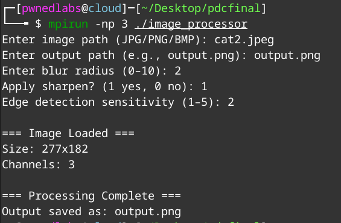

# Distributed image processing using MPI and OpenMP

## How to run:

Compile using:

```bash
mpic++ -fopenmp -o image_processor main.cpp -lm
```
Run Using:

```bash
mpirun -np 3 ./image_processor  
```

### Sample:

When run using `mpirun`, the structure is shown in the sample screen shot


